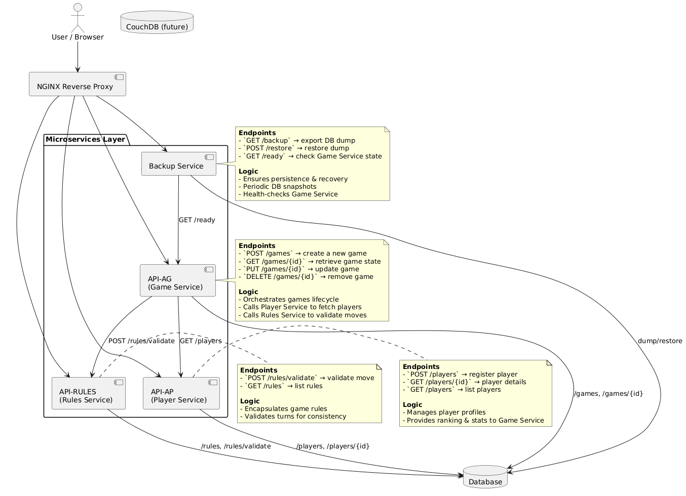
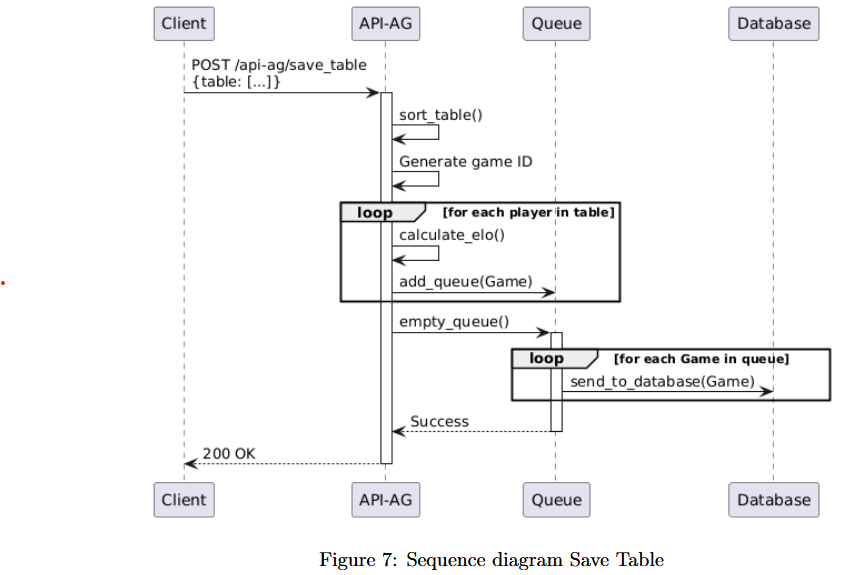

# 🃏 Gabo_Dev – Microservices Card Game Platform

## 🚀 Overview
**Gabo_Dev** is a distributed web application that manages and archives games of the card game *Gabo*.  
The project demonstrates a **microservices architecture** built with **Python/Flask**, containerized with **Docker**, orchestrated via **Docker Compose**, and integrated with a **CI/CD pipeline (GitHub Actions)**.  

Main goals:  
- Store and archive games and player data.  
- Provide REST APIs for services.  
- Deploy in containerized environments (Docker + Kubernetes), only Docker is still up.  
- Experiment with DevOps best practices (CI/CD, observability, testing).  

---

## 🏗️ Architecture

### Global view

- **API-AG**: Game management service.  
- **API-AP**: Player management service.  
- **API-RULES**: Game rules service that fetch from a kaggle dataset.  
- **Backup Service**: Backup and restore service.  
- **Database**: Persistent storage (MySQL).  
- **Nginx**: Reverse proxy / frontend gateway.  

---

## 🔄 Sequence Diagrams
Each module is documented with a sequence diagram to illustrate its internal workflow.  

### Example: API-AG Startup

Steps:  
1. **Backup Service** calls `GET /ready`.  
2. API-AG tests connection to the database.  
3. Retrieves all players (`get_all_players`).  
4. Builds index mappings.  
5. Queries the max game ID (`get_nb_game_in_db`).  
6. Returns `200 OK` if ready.  

👉 More documentation is available in the report including activity et sequence diagram. 

---

## ⚙️ Deployment

### Local (Docker Compose)
"""bash
docker-compose up --build"""

### Remote (Docker Compose)
See Workflow deployment for GCP

### Remote (Kubernetes)
Deployment not up anymore, See kubernetes' YAML config files in the production branch. Host on Kubernetes engine of GCP
